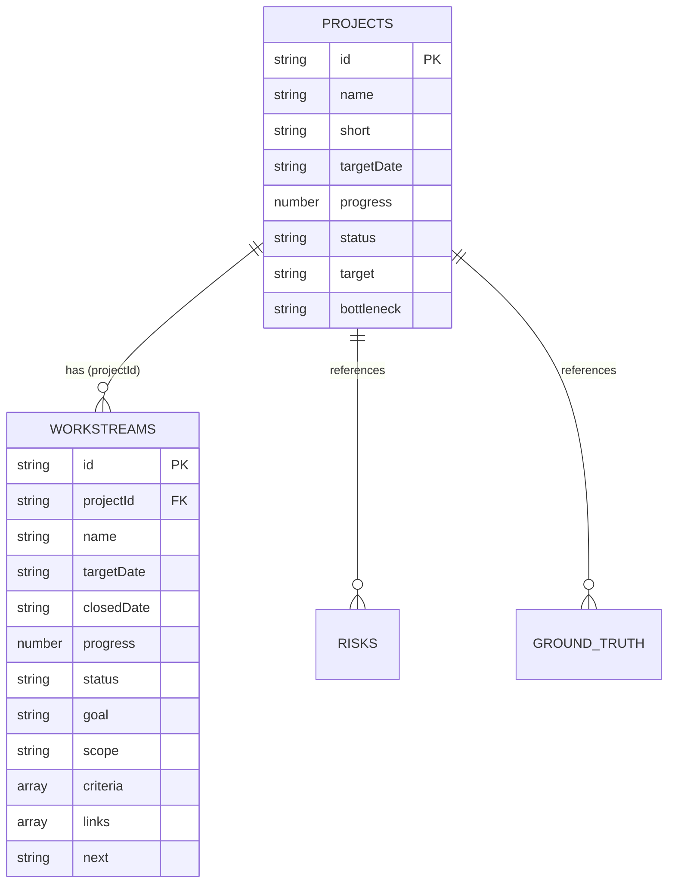

# Research Command Center (대시보드)

연구소 4대 핵심 프로젝트와 업무 실행 현황을 실시간으로 조망하고 추적하는 원페이지 대시보드입니다.

---

## 🚀 실행 방법

대시보드 데이터는 비동기 JSON Fetch 방식으로 로드되므로, 브라우저 보안(CORS) 정책에 따라 **로컬 웹 서버** 환경에서 실행하는 것을 권장합니다.

### 1. VS Code Live Server 사용 (가장 간단)
- VS Code에서 `personal/dashboard/index.html`을 우클릭하고 **"Open with Live Server"**를 클릭합니다.

### 2. Python 로컬 웹 서버 사용
터미널에서 아래 명령어를 실행한 후 브라우저에서 `http://localhost:8000`으로 접속합니다:
```bash
cd personal/dashboard
python -m http.server 8000
```

### 3. Node.js (npx serve) 사용
```bash
cd personal/dashboard
npx serve .
```

---

## 📂 파일 및 데이터베이스 아키텍처

UI 렌더링 로직(`app.js`)과 데이터(`data/*.json`)가 완전히 분리되어 있으며, 향후 실제 서버의 RDB(PostgreSQL, SQLite 등) 마이그레이션을 고려하여 **도메인별 정규화된 JSON 테이블 구조**로 설계되었습니다.

```text
personal/dashboard/
├── index.html               # 대시보드 마크업 구조
├── styles.css               # UI 디자인 및 100vh 반응형 스타일
├── app.js                   # UI 렌더링, 이벤트 핸들러 및 JSON RDB Join 로더
├── README.md                # 대시보드 문서 및 운영 가이드
└── data/                    # [JSON Database] 정규화된 도메인별 데이터 테이블
    ├── meta.json            # 대시보드 종합 요약, 커버리지 지표 및 Next Control
    ├── projects.json        # [Table: projects] 4대 핵심 프로젝트 마스터 (PK: id)
    ├── workstreams.json     # [Table: workstreams] 세부 실행 태스크 (FK: projectId)
    ├── risks.json           # [Table: risks] 핵심 리스크 및 의사결정 매트릭스
    └── ground_truth.json    # [Table: ground_truth] 정량 실측치/성공기준 지표
```

### 🗄️ JSON 테이블 관계 다이어그램 (ERD)



---

## 🖥️ 주요 기능 및 뷰 모드

- **THIS WEEK SCHEDULE (주간 실행 일정)**:
  - `data/workstreams.json`의 `targetDate`를 기반으로, KST 기준 이번 주 월~일에 해당하는 업무를 자동 계산하여 상단 캘린더에 동적 매핑합니다.
- **1단계 (기본 모드: 요약 및 실행 통합 뷰)**:
  - 상단 **THIS WEEK COMPASS** 및 **THIS WEEK SCHEDULE**이 표시됩니다.
  - **RESEARCH PORTFOLIO** 행을 클릭하면 해당 프로젝트 내부에서 상세 내용이 바로 확장됩니다.
    - **Workstream 아코디언 및 필터**: 프로젝트별 세부 실행 단위(미완료/완료 필터 지원)가 표시되며, 클릭 시 상세 목표, 범위, 판정 기준, 관련 링크, 현재 현황이 펼쳐집니다.
- **2단계 (전체 상세 뷰)**:
  - 1단계의 포트폴리오/일정과 함께 **BOTTLENECK → ACTION**, **GROUND TRUTH**, **CONTROL COVERAGE**, **NEXT CONTROL** 등 모든 리스크와 검증 지표가 전체 2열 그리드로 표시됩니다.
- **모드 전환 단축키**:
  - `Tab` 키를 누르거나 우측 상단의 버튼(1️⃣ 1단계 / 2️⃣ 2단계)을 클릭하여 뷰 모드를 전환할 수 있습니다.

---

## 📝 데이터 수정 및 갱신 방법

더 이상 `app.js` 소스코드를 수정할 필요가 없으며, **`data/` 폴더 내의 해당 JSON 파일만 수정**하면 됩니다:

1. **프로젝트 기본 정보/진척도 변경**: `data/projects.json`
2. **세부 업무 추가/일정/진행률/링크/완수일 변경**: `data/workstreams.json`
3. **리스크 등록 및 조치사항 갱신**: `data/risks.json`
4. **실측치/Ground Truth 갱신**: `data/ground_truth.json`
5. **상단 종합 헤드라인 및 커버리지 통계**: `data/meta.json`

---

## 🎯 데이터 해석 원칙

- 원본: `연구소 전체 회의록 기반 통합 업무 총람`
- 문서에 신뢰 가능한 프로젝트 진행률(%)이 없는 경우 임의 숫자를 생성하지 않고 `N/A`로 표시합니다.
- `PASS / PROGRESS / RISK / FAIL`과 `Progress`는 별도 개념입니다.
- Ground Truth가 있는 경우 목표와 실제 수치를 분리합니다.
- 과거 마감일이 지났더라도 후속 회의에서 상태가 갱신될 수 있으므로 자동으로 FAIL 처리하지 않고 확인 필요 상태로 추적합니다.
